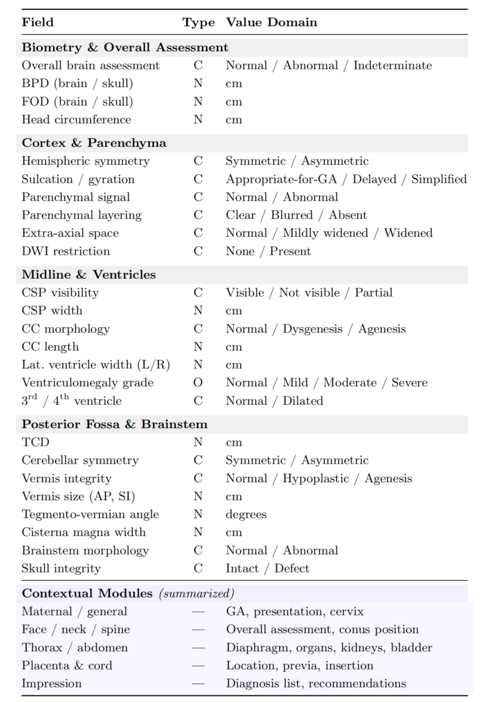

# ASTAR: Automatic Template Induction for Medical Report Structuring
> ASTAR automatically induces standardized reporting templates from large-scale free-text medical corpora, replacing labor-intensive manual template design with a scalable data-driven pipeline.
## Overview

ASTAR is a three-stage framework for automatically inducing structured reporting templates from large-scale free-text medical reports.

Given a corpus of free-text reports, ASTAR:
1. builds a canonical concept slot library,
2. organizes slots into a hierarchical template tree,
3. refines the template into a standardized final schema.

This design removes the need for manual template engineering and makes it easier to adapt structured reporting to new medical domains.

<p align="center">
  
</p>

**Input:** free-text medical reports  
**Output:** a hierarchical structured template that can be used to organize new reports

## Features

- **Automatic Template Induction**: Learn report structure from data without manual template design
- **Three-Stage Pipeline**: Slot induction, template assembly, and refinement
- **Comprehensive Evaluation**: Template quality, information fidelity, and diagnostic fidelity metrics
- **Modular Design**: Easy to extend and customize for different medical domains

## Installation

```bash
# Clone the repository
git clone https://github.com/xinfzhang/ASTAR.git
cd ASTAR

# Install in development mode
pip install -e .

# Install with evaluation dependencies
pip install -e ".[eval]"

# Install all dependencies
pip install -e ".[all]"
```

## Quick Start

### 1. Configuration

Copy the example environment file and add your API key:

```bash
cp .env.example .env
# Edit .env and set ASTAR_API_KEY=your_api_key_here
```

Edit `config.yaml` to configure:
- LLM endpoint and model
- Data paths
- Pipeline parameters

### 2. Template Induction

```bash
# Run the full template induction pipeline
astar-induction --config config.yaml

# Or run specific steps
astar-induction --steps 0 1 2  # Run only Stage I (slot induction)
astar-induction --start 3      # Start from Stage II
```

### 3. Report Structuring

```bash
# Structure reports using the induced template
python -m astar.structuring.structure \
    --data data/test.csv \
    --template output/exp_001/template_final.json \
    --output output/structured_output.json
```

### 4. Evaluation

```bash
# Run all evaluation metrics
astar-eval \
    --template output/exp_001/template_final.json \
    --structured output/structured_output.json \
    --gt data/test.csv

# Skip slow BERTScore evaluation
astar-eval ... --skip_bert
```

## Result Preview

After template induction, ASTAR produces a final hierarchical template (`template_final.json`) that organizes clinical findings into anatomical and semantic groups.

### Example Template Visualization
A simplified visualization of the induced template is shown below. This figure presents only a compact subset of the final hierarchical template for readability.
<p align="center">
  
</p>


## Evaluation Metrics

- **Template Quality**: Cov_case (case-level coverage), Cov_key (key-level coverage)
- **Information Fidelity**: ROUGE-1/2/L scores
- **Text Similarity**: chrF, chrF++, BERTScore
- **Diagnostic Fidelity**: PDA, KFP, CA


## Configuration Reference

See `config.yaml` for all available options. Key settings:

```yaml
llm:
  base_url: "https://api.openai.com/v1"  # OpenAI-compatible endpoint
  model: "gpt-4o-mini"
  embedding_model: "text-embedding-3-small"

data:
  train_csv: "./data/train.csv"
  description_column: "description"
  diagnosis_column: "diagnosis"
```

## Python API

```python
from astar.core.config import get_config, load_config
from astar.induction import run_pipeline
from astar.structuring.structure import structure_reports
from astar.evaluation import run_all_evaluations

# Load custom config
load_config("path/to/config.yaml")

# Run template induction
output_dir = run_pipeline()

# Structure reports
results = structure_reports(
    data_path="data/test.csv",
    template_path=f"{output_dir}/template_final.json",
)

# Evaluate
metrics = run_all_evaluations(
    template_path=f"{output_dir}/template_final.json",
    structured_path="output/structured_output.json",
    gt_path="data/test.csv",
)
```

## Requirements

- Python >= 3.9
- See `pyproject.toml` for full dependency list

## License

MIT License

## Citation

If you use ASTAR in your research, please cite:

```bibtex
@article{astar2026,
  title={ASTAR: Automatic Template Induction for Medical Report Structuring},
  author={...},
  journal={...},
  year={2026}
}
```
